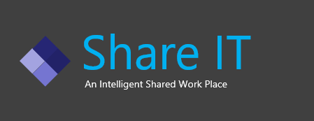
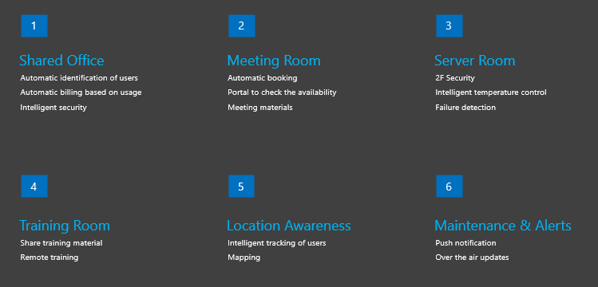
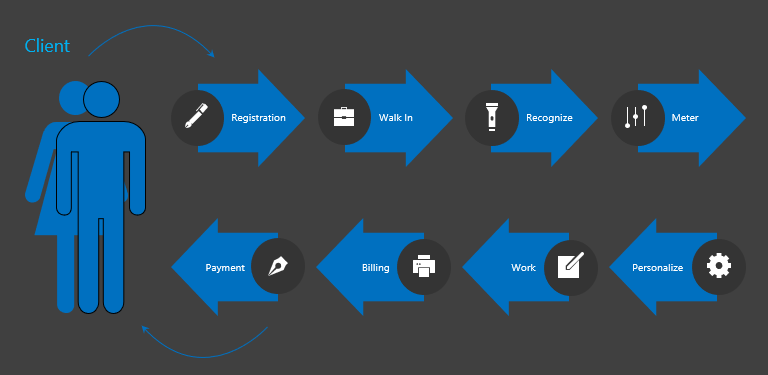
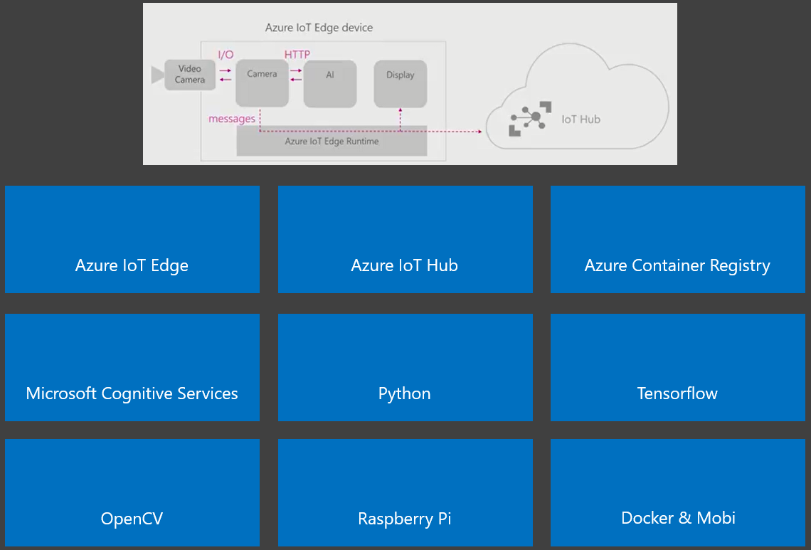

    
Solution Name: Share IT    
An Intelligent Shared Work Place    
Team Name: Bravo

Share IT’s Intelligent Real Time Cloud Services    

One of the Use Cases    

Technology Stack    

One of Share IT's key technology is the ability to use facial recognition for member authentication.

Baseline Code was forked from:
https://github.com/Azure-Samples/Custom-vision-service-iot-edge-raspberry-pi

ImageClassifierService was modified to use trained model (from customvision.ai) for facial logins.     
SenseHatDisplay was modified to display based on logins (numeric instead of fruits.)

Lessons (Resolutions) while implementing the solution:
* Encountered device startup issue. Solved by updating the String Primary Key. Primary key should also include HostName and DeviceId. SharedAccessKey alone is not enough.
* Documentation is not the same when opened in different browsers. For example: https://docs.microsoft.com/en-us/azure/iot-edge/quickstart-linux One shows the steps using Azure CLI. The other version shows how to create using GUI. Resolution: For the wanted document version, export it as PDF and share to the rest of the team.
* Dockerfile build fails with "exec format error". Resolution: Ideally this should work (but needed further investigation). Meanwhile, this error was by passed by removing **RUN [ "cross-build-start" ]** from the dockerfile.

